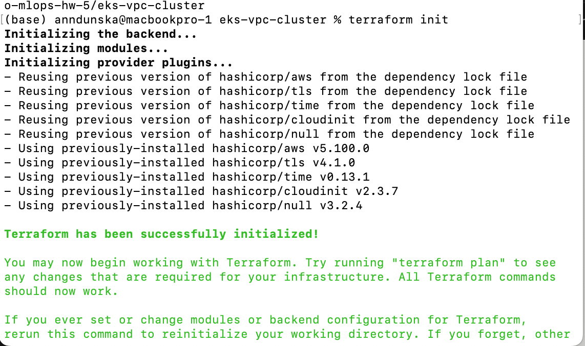
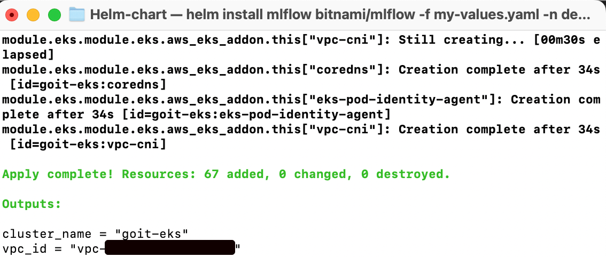

# Terraform VPC + EKS Cluster Deployment

Цей проєкт створює інфраструктуру AWS для ML-сервісів, використовуючи модулі Terraform:
 - terraform-aws-modules/vpc/aws
 - terraform-aws-modules/eks/aws

Компоненти інфраструктури:
 - VPC з public та private сабнетами, NAT та Internet Gateway
 - Kubernetes-кластер EKS у регіоні eu-north-1
 - дві node groups (cpu і gpu на t3.micro)
 - віддалений state у S3

## Pre Set Up

terraform:
```
brew install hashicorp/tap/terraform
```

kubectl:
```
brew install kubectl
```

AWS Profile:
1. Create IAM User
2. Generate Access Key 
3. Attach IAM Policies:
 - AdministratorAccess
 - AmazonS3FullAccess
4. Configure AWS CLI profile
```
aws configure --profile hannadunska
```
5. Create S3 bucket for Terraform backend:
```
aws s3api create-bucket \
  --bucket mlops-tfstate-hanna \
  --region eu-north-1 \
  --create-bucket-configuration LocationConstraint=eu-north-1 \
  --profile hannadunska
```

## Project Structure

```
eks-vpc-cluster/
├── main.tf
├── variables.tf
├── outputs.tf
├── terraform.tf
├── backend.tf
├── vpc/
│   ├── main.tf
│   ├── variables.tf
│   ├── outputs.tf
│   ├── terraform.tf
│   └── backend.tf
├── eks/
│   ├── main.tf
│   ├── variables.tf
│   ├── outputs.tf
│   ├── terraform.tf
│   └── backend.tf
└── README.md
```
## Створення інфраструктури (VPC + EKS)

Перехід у корінь проєкту:
```
cd eks-vpc-cluster
```

Init:
```
terraform init
```


Apply:
```
terraform apply
```


## Перевірка доступу до кластера
```
aws eks \
  --region eu-north-1 \
  --profile hannadunska \
  update-kubeconfig --name goit-eks
```


## Перевірка нод
```
kubectl get nodes
```
